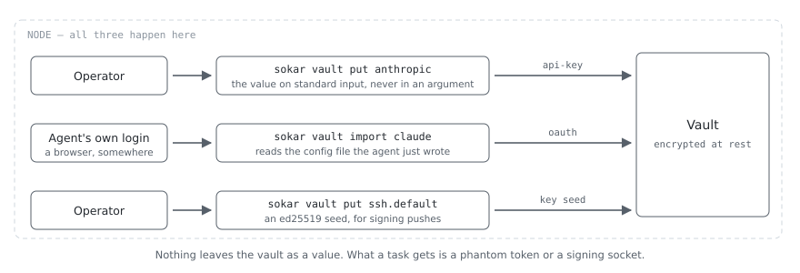

# Credentials

Two things need a credential:

- **the provider**, the model API an agent talks to;
- **the upstream**, the git remote work is pushed to, reached with an ssh key or a token.

Neither secret is ever in a task container. The secrets live in one vault on the host, and one rule
decides the rest: nothing on the daemon's socket ever carries a credential value.

## What a container gets instead


The agent gets a **phantom token**: random, scoped to its one task, and accepted for a bounded time
(`--token-hours`, eight by default). It presents that to a proxy on a unix socket bind-mounted into
the container. Per request, the proxy reads the real credential, drops every credential header the
agent sent (`authorization`, `x-api-key`, `private-token`, `proxy-authorization`), adds the right
one, and sends the request upstream over TLS. A leaked phantom token stops working when the task
ends. The proxy also finds the token in the header the provider or destination declares
(`auth_header`), so a key the service wants in a header of its own, such as `x-goog-api-key`, is
recognized as this task's rather than refused.

- **A socket, not a port.** The filesystem decides who may connect. The socket is world-writable
  and its parent directory is `0700`, because a rootless container's user is a subordinate uid that
  cannot open a `0600` socket.
- **The firewall must deny the provider's host too.** Otherwise an agent with a compiled-in base URL
  ignores the socket and sends the phantom token straight to the provider.
- **An API key and a subscription token are not interchangeable.** They go in different headers.
  Sending one as the other fails like a wrong key. Each provider declares this once in
  `providers/*.yaml` (`auth_header`, `auth_prefix`, with an `oauth:` entry beside `_default:`).

The git signing key works the same way. `sokar vault agent` runs an ssh-agent that signs with the
key from the vault and mounts its socket into the container as `SSH_AUTH_SOCK`. A container can ask
for a signature and cannot get the key. There is no `vault keygen`: `vault agent --ephemeral` makes
a throwaway key for one run, and a durable key is made elsewhere and stored with
`sokar vault put ssh.default`.

### What the proxy withholds

The proxy scans every provider answer for the JSON members `access_token`, `refresh_token` and
`id_token`, spelled plainly or with `\uXXXX` escapes, split across reads, or with any amount of
whitespace before the colon. The first 8 KB are held until they are examined, and an answer carrying one
there is withheld; the rest is examined as it streams, and an answer carrying one later is cut off at that
point, so the agent sees a truncated answer and never the credential.

- **What it refuses to guess about, it refuses.** An answer in any content coding but `identity`,
  or of a media type other than `application/json` or `text/event-stream`, fails closed with `502`.
  The proxy therefore asks the provider for `identity` itself, replacing the agent's
  `Accept-Encoding`.
- **The accepted gap:** this is filtering on known field names. A provider that names its credential
  differently is not covered. A full parser per response format was judged riskier, since one that
  mis-frames an ordinary answer breaks every task. The decision holds only while the three names and
  two media types are kept in line with what the supported providers emit.

## Model providers

A **provider** is who serves the models: where it is and how to speak to it. It is a data file, not a
program, found by scanning two directories, the first winning for a name both declare:

```
~/.local/share/sokar/providers/<name>.yaml     your own, and it wins
/usr/share/sokar/providers/<name>.yaml         what a package installed
```

```yaml
name: openrouter
label: OpenRouter
upstream: https://openrouter.ai
dialects:                  # the wire formats it serves, and the path each is under
  openai: "/api/v1"
  anthropic-messages: "/api"
auth_header:
  _default: Authorization  # an 'oauth:' entry beside it for a subscription token
auth_prefix:
  _default: "Bearer "
token_env:
  _default: OPENROUTER_API_KEY   # the variable a task's stand-in token is given in
```

An agent says which dialect it speaks, and an agent and a provider fit when the provider serves that
dialect; nothing pairs them by name. An agent that knows providers itself speaks `native`, the first
dialect the provider lists. So adding a provider needs no change to Sokar and no rebuild of any agent,
and an agent can drive a provider nobody wrote down for it. `sokar agents --verbose` shows the pairs,
with each agent's default, and `sokar task start --provider <name>` chooses one for a run.

**The vault is keyed by provider**, not by agent: one entry under `anthropic` serves every agent that
reaches Anthropic. An entry still stored under the agent's own name is used when there is none under
the provider's, and the task says how to move it (`sokar vault put <provider>`).

### The providers Sokar ships

Each is reached through the broker, with the credential on the host and a stand-in token in the task;
`sokar task status` names the provider a task was brokered to.

| Provider | Upstream | Reached by | Credential |
|---|---|---|---|
| `anthropic` | `https://api.anthropic.com` | its own agent, and any agent speaking `anthropic-messages` | an API key, sent as `x-api-key`, or a subscription token, sent as `Authorization: Bearer`; stored with `sokar vault put anthropic`, `vault import` or `vault login` |
| `openrouter` | `https://openrouter.ai` | any agent speaking `openai`, served under `/api/v1`, or `anthropic-messages`, served under `/api` | an API key, sent as `Authorization: Bearer`; stored with `sokar vault put openrouter` |
| `github-copilot` | `https://api.githubcopilot.com`, every path at its root | any agent speaking `openai` | a GitHub token granted once through the device flow, sent as `Authorization: Bearer`; see [a subscription granted once](#a-subscription-granted-once-github-copilot) |

- **OpenRouter's path depends on the dialect.** A base URL that misses it answers "model not found"
  rather than 404, which reads as a bad model name.

## Getting a credential in



All of these happen on the host, and the vault has to be open (`sokar vault unlock`).

| Command | What it does |
|---|---|
| `sokar vault put <name>` | stores a value you type or pipe in, such as an API key or an ssh key |
| `sokar vault import` | copies the credential an agent already installed on this machine holds |
| `sokar vault login` | runs the agent's own login and stores what it produces |
| `sokar vault authorize <name>` | runs a grant Sokar asks for itself: a device code, or a redirect to a loopback port |

**`vault put` never takes the value as an argument**, because an argument list is world-readable.
At a terminal it asks without echoing, so a pasted key does not land in the scrollback. A piped
value is read from standard input. An ssh key goes in as the file you were given
(`sokar vault put github-work < ~/.ssh/id_ed25519`); the vault converts it to the 32-byte signing
seed. A key with a passphrase, or of an algorithm Sokar does not sign with, is refused by name.

**`vault import`** saves retyping, and with it the commonest mistake, storing the guide's
placeholder instead of the key.

**`vault login`** is for a machine where the agent was never installed by hand. It runs the login
in a throwaway container from the task image, which has none of a task's hooks and ordinary network
access for the seconds the login takes.

### A subscription granted once: GitHub Copilot

Copilot is reached with a GitHub token a person grants once, through GitHub's device flow, stored as
an `oauth-device` entry named after the provider:

```
sokar vault put github-copilot --type oauth-device --setting client_id=<an OAuth app Copilot accepts> \
    --setting device_authorization_url=https://github.com/login/device/code \
    --setting token_url=https://github.com/login/oauth/access_token --setting scopes=read:user
sokar vault authorize github-copilot
sokar task start --provider github-copilot --model <a model the agent lists for Copilot> ...
```

- The token never expires and has nothing to renew it. The task gets a stand-in of its own in
  `COPILOT_GITHUB_TOKEN`.
- **Nothing here can revoke it.** Revoke it on GitHub under Settings → Applications → Authorized
  OAuth Apps. `vault remove` says so, and forgets it only with `--without-revoking`.
- The model must be one the agent lists for Copilot; otherwise Copilot answers `400`.
- The broker attaches the token to `api.githubcopilot.com` as it is; no exchange for a short-lived
  token happens through the task, so the task needs no route to `api.github.com`.

## A sign-in that ends, renewed on the host

A subscription sign-in leaves an access token that ends within hours and a refresh token that
renews it. **`sokar vault login` keeps both.** `vault list` shows the access token's settings
(`expires_at`, `token_url`, `client_id`); the refresh token is stored beside it and shown nowhere.

**The broker renews it on the host, never in the task.** It uses the stored token until a minute
before it ends, then renews it and writes the new token, its end and the rotated refresh token back
into the vault. Each task has its own broker, so the renewal is one update under the vault's lock:
whichever broker comes second finds a fresh token and uses it. A renewal the agent asks for itself is
refused, and a token in an answer is still withheld from it.

- **`vault import` is never renewed.** Renewing that copy would spend the refresh token the
  developer's own session uses. Import again when it has ended.
- **`vault remove` forgets the refresh token with the entry.**

## More than one credential in a task

A task can also hold credentials for other services, such as a search API, a forge or an MCP server.
Each works like the agent's: the container gets a token worthless anywhere else.

1. **Say where the service is** in `~/.local/share/sokar/destinations/<name>.yaml` (packages install
   theirs in `/usr/share/sokar/destinations`). A model provider is a destination too.

   ```
   name: brave-search
   upstream: https://api.search.brave.com
   auth_header: X-Subscription-Token   # where the key goes
   auth_prefix: ""                     # text before it, for example "Bearer "
   # auth_query: key                   # or in the URL instead, for a service that wants ?key=
   ```

   With `auth_query`, the key travels in the URL: the proxy takes the task's token out of that query parameter,
   puts the real key into the same parameter of the request it sends upstream, and adds it to no header. **No value
   in a query string reaches the proxy's log**: a logged request keeps its path and the names of its parameters,
   never their values.

2. **Store the key:** `sokar vault put search`. Configuration goes in settings, such as
   `--setting token_url=https://auth.example.com/token`. Settings are printed, so no secret belongs
   in one.
3. **Name it** for every task of a project in [`project.yml`](project-file.md) under
   `credentials:` (`search: brave-search`, entry to destination), or for one run with
   `sokar task start ... --credential search=brave-search`. A run can add credentials but not
   remove or redirect the project's. **Anyone who can start a task in the project can use its
   credentials.** An offline project names none.

Inside the task each appears as `SOKAR_TOKEN_<NAME>` and `SOKAR_URL_<NAME>`:

```
curl -H "X-Subscription-Token: $SOKAR_TOKEN_SEARCH" "$SOKAR_URL_SEARCH/res/v1/web/search?q=sokar"
```

**The token decides where a request goes, never the request.** A key held for one service cannot be
attached to a request for another. A tool whose address is compiled in and cannot be pointed at
`SOKAR_URL_<NAME>` cannot use this.

`sokar task start` names each credential the task was given, the host it goes to, and its two
variables; it never prints a stored value. A destination's host is reached by the broker, on the
host, and is not added to what the task itself can reach. A destination nobody declared refuses the
start before anything is made, and so, for an unattended run, does a credential the vault does not
hold. A stopped task that starts again gets the same tokens back.

## A credential that buys its token

Some services take no stored key: the client presents a client id and secret to an authorization server
(OAuth `client_credentials`) and spends the short-lived token it gets back. Sokar's broker does that on the
host. Store the secret with its settings:

```
sokar vault put orders-api --type client-credentials \
  --setting token_url=https://auth.example.com/token \
  --setting client_id=sokar-ci \
  --setting scopes=orders.read
# optionally: --setting audience=https://orders.example.com
```

`token_url` must be `https`. Name the entry with a destination as for any other credential. The broker buys
a token when the task first needs one, keeps it in memory - never on disk, never shared with another task -
and buys again a minute before it ends; requests that arrive together wait for the one purchase. The
container sees only its own task-scoped token: never the secret, never the bought token.

At start the purchase is tried once. If it fails, an unattended or agent run is refused before a container
exists, and a shell task warns and starts. A failure during the run reaches the container as `503`, saying
either "the authorization server at <host> refused these client credentials" or that it could not be reached;
neither repeats what the server sent back. The authorization server is reached by the broker alone and is not
added to what the task can reach. A grant asked for from inside the container is refused before it is
forwarded: the broker holds this credential and buys or renews its tokens itself.

## What this machine connects out with

The host itself connects out too: following a project, measuring how far a mirror is behind,
forwarding an approved change. Whoever started it, the connection is made by this host, so its
credential is chosen here. A credential is a record plus a secret, kept apart:

```
~/.config/sokar/credentials.yml     kind, destination, username, where the value lives
~/.local/share/sokar/vault.bin      the value, when this machine keeps it
```

The record holds nothing secret and is readable with the vault shut, so Sokar can tell "unlock the
vault" from "nothing is configured, store one".

```
sokar credentials declare "ssh://github.com" --kind ssh-key --vault github-work
sokar vault put github-work < ~/.ssh/id_ed25519      # the value, separately
sokar credentials declare "ssh://github.com" --kind ssh-key --agent   # or: use my own ssh-agent
sokar credentials check git@github.com:acme/x.git    # what would be used, without connecting
```

- **The kind is said, not guessed:** `ssh-key`, `token`, `basic` or `oauth`.
- **The longest `match` wins**, after normalising `git@host:path` to `ssh://host/path`.
- **Four sources.** `vault` is encrypted and shut when idle. `file` (such as `~/.ssh/id_ed25519`)
  and `env` are not protected by Sokar, and `credentials list` says so. `agent` uses the account's
  own ssh-agent and reads nothing.
- **With no `credentials.yml`** a git URL falls back to vault entries named after its host:
  `git.ssh.<host>`, `git.token.<host>`, then `ssh.default`.
- **A key never leaves the vault.** Sokar serves an ssh-agent for the length of the command. A token
  reaches git through git's credential helper over a pipe, for that host only; nothing is written to
  a config and no value is on a command line.
- **An `oauth` record is not renewed.** An expired one is refused by name, with what to run.

## Working from another machine

**No secret crosses the daemon's socket**, in either direction: no credential value, no vault
passphrase, no recovery secret. A remote interface reaches the socket only through an ssh forward,
so its user already has a shell on the host, and secrets are typed there:

```
ssh node
sokar vault put anthropic     # asks at the terminal, and does not echo
```

This is not about transport security, as ssh encrypts either way. It keeps plaintext out of GUI
processes, clipboards and crash dumps, and out of the socket layer, whose JSON ends up in logs. The
entry name is the provider's name, falling back to the agent's. If ssh is locked to a forced command
with no shell, a remote person cannot store a new credential, only import one already on the host.
Whether the rule should stay is an open design question; until it is decided, this is the rule.

**An IDE's remote backend on the host is not a way to review a task's work.** It runs as the account that holds
the unlocked vault, the daemon's socket and the deploy keys, and building or testing the work there runs the
agent's code with all of it. Fetch the waiting work into your own clone (`sokar gate pending` says how) and open
it in your IDE's safe mode; run it only in a container on the machine.

### A login from a laptop


Only the public authorization URL goes to the laptop, and only a single-use code comes back. The
token is delivered straight to the host. Where a login redirects to a loopback port, `vault
authorize` prints the forward to open: `ssh -L <port>:127.0.0.1:<port> <this machine>`. A
device-code flow needs no forward.

- It is a **local** forward, and the port cannot be remapped: use the port in the printed URL.
- A forward opened before the listener exists works as soon as it comes up. OpenSSH binds both
  `127.0.0.1` and `[::1]`.
- **A port collision lies.** If something already holds the laptop's `127.0.0.1:<port>`, ssh still
  exits `0`, binds only `[::1]` and prints the error on stderr. Verify a forward by connecting
  through it, never by ssh's exit code.
- An existing connection can add and drop the forward without re-authenticating:
  `ssh -S <ctl> -O forward -L 8484:localhost:8484 node`, then `-O cancel`.

## The vault's keyslots

The vault is one AES-256-GCM file. Its master key is made once and stored only wrapped, once per
credential that may open it. The whole header is authenticated, so nothing in it can be changed
unnoticed. A file of another version is refused; create it again with `sokar vault init`.

- **Keyslot 0 is the passphrase**, wrapped with Argon2id. It is the recovery credential, typed by a
  person and stored nowhere. `sokar vault passphrase` changes it and asks for the current one; a
  device cannot replace it. A change replaces one slot and every device keeps working.
- **Every other slot is a device**, holding a 32-byte share in its own keystore. The host cannot
  open a device slot by itself, so a copy of the machine is not a copy of the vault.
- **An unlock keeps the share or the passphrase in the kernel keyring**, never the master key, so a
  revoked slot stops working at once. The daemon opens the vault only with a device's share, never a
  passphrase.
- **A slot's name, enrolment time and last use are readable while the vault is locked.** None of it
  is secret, and a device unused for months is easy to spot.

`sokar vault devices` lists the slots and what each is worth. The host records the storage a device
declares but cannot check it. On a desktop the share usually sits in a keyring any process of that
user can read, which is still better than a stored passphrase: it is scoped to one device and
revocable.

```
ID                                     KIND         NAME                 WHAT IT IS WORTH
passphrase                             passphrase   passphrase           typed by a person, stored nowhere
b0ab092b-2d16-4f3d-8343-6bf8f9821cb4   device       the GUI laptop       any process running as you can ask for it

Remove one with: sokar vault revoke <id>
```

A locked vault makes every flow on this page answer "not yet" rather than "missing".
