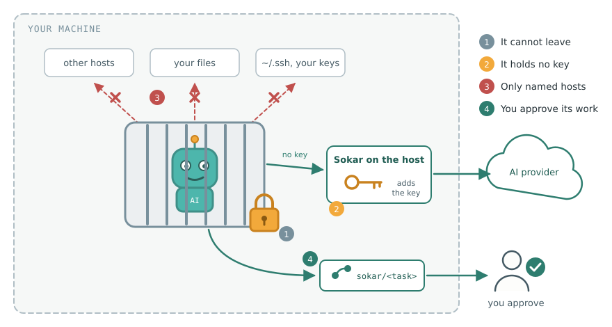

# The elevator pitch

What Sokar is, in a few sentences to remember rather than read out. Start with the one sentence; the
rest is there when somebody asks.

## In one sentence

Sokar lets AI coding agents work on your code without letting them reach anything else: each one runs
in a container it cannot leave, holds no credential, and its work comes back as a branch you review.

## In thirty seconds

AI coding agents are useful, and they run with your rights: your keys, your network, your
repositories. Sokar puts each agent in a rootless container it cannot leave. The agent never holds a
credential: the host attaches it on the way out, and only for the provider it belongs to. The task
reaches only the hosts declared for it, and everything else is refused. The agent works on its own
copy of your repository, and in the default class its work comes back only as a branch you look at
and approve. Installed with apt or dnf, one native program, for any agent: Claude Code, Pi, Oh My Pi.

## For a developer

You keep the agent you like and stop watching it. It runs in a container with its own copy of the
repository, so it can try anything there without touching your working tree, your `~/.ssh` or your
other projects. When it is done, its work waits as a branch: `sokar gate checkout` opens it, and
`sokar gate approve` sends it on as `sokar/<task>`. See [Getting started](getting-started.md).

## For a security officer

The enforcement is not in the agent. The container runs rootless with every capability dropped. A
name the project did not declare does not resolve, and a declared host is reachable on ports 80 and 443
only. The container holds a stand-in token; a proxy on the host swaps it for the real credential, which
stays in an encrypted vault on the machine. A reach for something undeclared is blocked and asks a
person. What Sokar does not close, above all what the model provider sees, is said as plainly on
[How far a task can get](reach.md). See [Sokar in a company](corporate-security.md).

## For a manager

Your developers can use AI coding agents on real code without handing them the keys to everything
else. A person decides what leaves the machine, the agent's reach is written down per project, and it
runs on the Linux machines you already have, installed like any other package.

## The questions that follow

**Why not just Docker?** A container alone keeps the agent's files apart, and little more: the agent
still needs a credential inside it, and its network reaches whatever the host does. Sokar adds what
the container does not: no credential inside, a resolver and a firewall of the task's own that let
through only the declared hosts, and a gate between the task and your upstream.

**Can the agent be talked into something?** Yes; anything that reads text outsiders wrote can be, and
Sokar does not try to detect it. It bounds what a convinced agent is worth instead: what it can reach,
hold, spend and produce. See [How far a task can get](reach.md).

**Does my code leave the machine?** To the model provider, yes: an agent sends what it reads to its
provider, and no security class closes that. To anywhere else, only the hosts the project declares.

**Which agents?** Claude Code, Pi and Oh My Pi today. An agent is a separate package, so another can
be added without a new release of Sokar.

**Where does it run?** On Linux: Debian, Ubuntu, Fedora and RHEL. It is built on kernel machinery a
macOS or Windows host would keep on the far side of a virtual machine.

**Does every change need my approval?** In the default class, `guarded`, yes. A project can choose
`offline`, where work stays on the machine, or `online`, where the task's branch goes on at once and
any review happens afterwards. See [Security classes](security.md).
