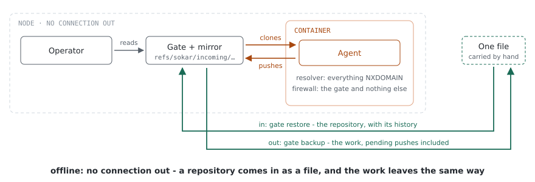
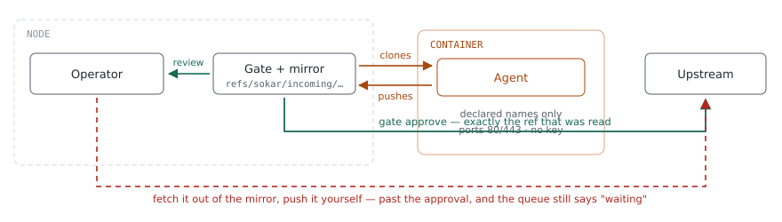
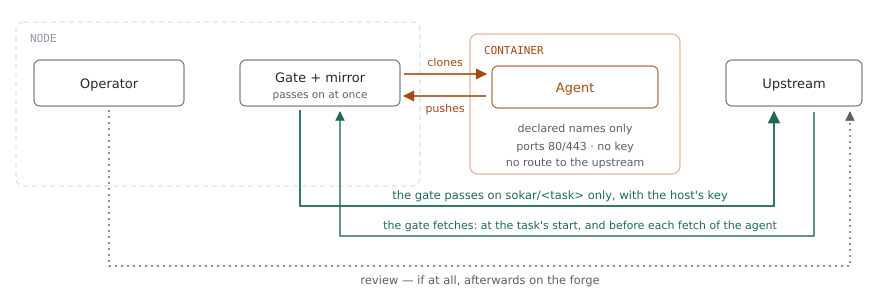

# Security classes, firewall and names

A project declares one of three security classes. The class decides two things: what a task may
reach, and where somebody looks at its work before it goes anywhere. Underneath every class sit the
same two layers, a packet filter and a resolver of the task's own.

This page says how those parts work. What a task can still do once it is convinced, and above all
what the model provider sees, which no class closes, is on [How far a task can get](reach.md).

## The three security classes

The same actors appear in all three pictures, in the same places. What changes is the path the
work takes.

| | offline | guarded (default) | online |
|---|---|---|---|
| **In** | seeded from the mirror | cloned from the mirror | cloned from the mirror, which fetches from the upstream first |
| **Out** | into the mirror; off the machine only by hand | `sokar gate approve` | the gate passes the task's own branch on at once |
| **Credential in the container** | none | none | none |
| **Review** | by hand, out of the mirror | at the gate, before the upstream | none, unless somebody does it on the forge afterwards |

### offline

Nothing resolves and nothing leaves. The agent works against a mirror on this machine. There is no
route to the upstream, not for the agent and not for a person inside the container either.



"Nothing leaves" is about the container, and the mirror is not in it. The mirror is a bare
repository on the host:

```
$XDG_DATA_HOME/sokar/mirrors/<project>.git     # ~/.local/share/sokar/mirrors/<project>.git by default
```

Any further repository of the project has its own beside it, at
`mirrors/<project>/<repository>.git`. There is one per repository and per OS user. The agent clones
from it and pushes back into it, so both questions, how history gets in and how work gets out, are
answered on the host, by a person.

**Getting a history in.** The mirror is seeded from the first of these that exists:

1. `--upstream` on the command,
2. the project's `upstream:`,
3. the checkout you are standing in. Committed history only, since a bare clone has no working
   tree.

The third needs no network at all: `cd` into your own working copy and start the task. Sokar prints
that it seeds from there rather than doing it silently, because the seed decides what the agent
believes the project is. A mirror that already exists is never re-seeded. The other way in is
`sokar gate restore`, from a bundle carried here by whatever means a disconnected machine has.
A followed project's own repository is seeded from the clone this machine verified, so its history
is not fetched from the forge a second time, and the task's start says so (`seed ... (the followed
clone)`).

**Getting changed work out.** The agent's push lands in the mirror, so the work is on the host the
moment the task ends. From there:

- `sokar gate checkout <name> --project <project>` opens waiting work as a copy you can read;
- `sokar gate backup <file> --project <project>` writes the whole mirror, pending pushes included,
  as one bundle, a single file to carry to a machine that has a route;
- or fetch from the mirror into your own checkout, since it is an ordinary git repository:
  `git fetch ~/.local/share/sokar/mirrors/<project>.git`.

**What the class is for.** A project whose upstream must not be reachable from a task, because the
code is sensitive, the agent is not trusted with a route, or the machine has none. Also a project
with no upstream at all, where the mirror is the origin. The cost is that nothing moves off this
machine unless a person moves it. That is the guarantee, not a gap in it.

### guarded

The default, and the one the gate was built for. The agent pushes to a gate on this machine. The
work waits under `refs/sokar/incoming/<task>` until somebody reads and approves it, and the approve
is what forwards it.



The dashed path is not a hole in the container. It is a person with their own key, fetching the
agent's branch into their own checkout and pushing it. Nothing stops that, so `sokar gate checkout`
makes the safe way the convenient one: it opens the waiting work as a copy whose only remote is the
gate and in which no hook runs. Two things to know about the shortcut:

- **The gate then says something untrue.** `approve` pushes and deletes the incoming ref, and the
  delete is what empties the queue. A push made by hand leaves the ref, so `gate pending` shows the
  work as waiting for ever, and a later `reject` records it as discarded while it is live upstream.
- **The agent's own working copy cannot be offered instead.** It stays inside the container on
  purpose. A bind-mounted one would let the agent write `.git/hooks/`, which then run with the
  privileges of whoever next runs git in that directory.

### online

The agent works against the gate on this machine, as in `guarded`: it clones from it and pushes to
it, and its container holds no key, no socket of one, and no route to the upstream. What differs is
what the gate does with a push. It passes the task's own branch on to the upstream at once, as
`sokar/<task>`, with the key the host lends for it, and the agent's push succeeds only when the
upstream took it; a refusal by the forge fails the agent's push with the forge's words. The gate
refuses a push to any other branch, a tag, a deletion and any other repository; a push with force
to the task's own branch goes through, since an agent that rebases needs it. Before the agent
fetches, the gate fetches from the upstream - at most once every few seconds, so an agent fetching
in a loop cannot make the host flood the forge with your key.

Nothing is reviewed before it lands. That is what the class is for, and why a project has to
choose it; a task cannot ask for it. The forge builds the branch at once, and the task is told
what its builds did ([Running](running.md)).



### What the pictures do not show

Every arrow above runs through the same firewall: declared names resolve, everything else is
NXDOMAIN, and only ports 80 and 443 are open to the addresses those names answer with. The gate's
own endpoint is the exception, and it binds loopback. The rest of this page is those two layers.

## The firewall

Every task container has its own packet filter. Nothing Sokar does touches the host's own firewall,
and two tasks on one machine, or two people in two accounts, never share a rule. A machine-wide
filter would have to be the union of everything every task may do, the opposite of what a
per-project declaration is for.

### Where the firewall sits

The rules live inside the container's network namespace. They are put there from outside, and
nothing inside can reach them. The guarantee is all three facts together:

1. **Generated on the host, before the container exists.** Sokar renders the complete nftables
   ruleset from the project's security class and its declared egress, and writes it to a file. The
   component that loads it makes no policy decision of its own, so an operator can read the ruleset
   before anything runs.
2. **Loaded by an OCI hook** at the `createRuntime` stage, after the runtime has created the
   namespaces and before it pivots into the container's filesystem. The hook runs
   `nsenter --target <pid> --net nft --file -`, with the ruleset on standard input.
3. **Unreachable from inside.** The container runs with `--cap-drop ALL` and
   `--security-opt no-new-privileges`. Changing the rules needs `CAP_NET_ADMIN` in that namespace,
   and the agent has no capabilities at all. It can be stopped by the rules; it cannot read them
   away or widen them.

So "inside or outside the container?" has no one-word answer: the rules are enforced in the
container's own namespace, which makes them per task, and the authority to write them stays on the
host.

### Fail-closed

**If the ruleset cannot be loaded, the container does not start.** A task that comes up without its
egress policy is exactly what Sokar exists to prevent, and it would look normal to the operator.
There is no window in which the agent runs and the filter does not.

### What the rules say

- **The output chain drops by default.** Everything else in the ruleset widens that and nothing
  narrows it. A bug that loses a rule fails towards no connectivity, not towards an open container.
- **A permitted name opens web ports, not the host.** Addresses reach the allow sets in two ways,
  both naming a host and never a port: the resolver adds each answer as it gives it, and an operator
  approves one address at a time. Accepting every port would grant far more, notably git over ssh,
  which would let an agent push straight past the gate. So only 80 and 443 are matched.
- **An allowed address is allowed for every name it serves.** The filter matches addresses, not
  names. If a declared host sits behind a shared CDN address, every other site at that address is
  reachable on 80 and 443 as well.
- **DNS reaches the upstream resolvers only from Sokar's own resolver.** Port 53 to an upstream is
  opened for the resolver's sockets alone; the agent's own query to an upstream is dropped and logged
  like any other. See [a resolver of the agent's own](#a-resolver-of-the-agents-own) below.
- **Drops are logged.** Every dropped packet is recorded through NFLOG with Sokar's own prefix. That
  turns a block into an audit trail and into the clearance question an operator can answer.

### Who may change it

Only the operator, from the host. A clearance approval adds one element to an existing set
(`nft add element inet sokar allowed_v4 …`) rather than reloading the ruleset; a reload would drop
conntrack state and kill every connection the task already had. It goes in the same way:
`podman unshare nsenter --target <pid> --net nft …`. The `podman unshare` is needed because a
rootless container's namespaces belong to the operator's user namespace.

#### Opening something while a task runs

Opening a name at runtime is two operations. The name is added to the resolver (see
[widening a running task by name](#widening-a-running-task-by-name)), and the addresses it answers
with reach the firewall through the clearance watcher.

## Names and the resolver

Every task container has its own DNS resolver, and it is the layer that blocks first.

### Where the resolver sits

A dnsmasq of Sokar's own runs inside the container's network namespace, on `127.0.0.1:53`, and the
container's `resolv.conf` points at it.

- **Its configuration is generated on the host** from the security class and the declared domains,
  before the container exists, like the ruleset.
- **An OCI hook starts it** at `createRuntime`, in the container's namespace. It is reaped when the
  container is gone.
- **It answers only the container**, on loopback (`listen-address=127.0.0.1`, `bind-interfaces`).
- **It ignores the host's `resolv.conf`** (`no-resolv`, `no-hosts`). Sokar chooses which upstream
  resolvers allowed queries go to.

### What resolves

**The default answer is NXDOMAIN, for every name.** A name resolves only if the project declares it:
deny by default, widen deliberately, the same shape as the packet filter. For an `offline` project
nothing resolves at all.

Blocking at the name rather than at the wire matters. A resolver that answered everything would
confirm to the agent that a host exists, and turn every stray lookup into a question for the
operator. Inside the container an undeclared name simply looks like:

```
Could not resolve host: repo.maven.apache.org
```

- **Every query is logged** (`log-queries`), so a refused name shows up in the audit trail.
- **Nothing is cached** (`cache-size=0`). A cached answer would keep resolving after the operator
  revoked the name.

**Resolving and being allowed to reach are one decision.** Every address the resolver answers for a
declared name is added to the firewall's allow set as it is answered, through dnsmasq's `nftset=`
option, for IPv4 and IPv6. Addresses are not pinned at task start, because large hosts rotate them;
what the container was told and what it may reach cannot drift apart. Without this, a declared host
would resolve and then be dropped, and the operator would get a clearance prompt for something the
project already declared.

dnsmasq must be built with `--nftset`. One built without it fails silently: names resolve and every
declared host is then dropped. `sokar doctor` checks for it.

### A resolver of the agent's own

**An address learned any other way opens nothing.** Only the resolver's answers and the operator's
approvals fill the allow sets. A program that asks a public resolver directly, uses DNS over HTTPS,
or has an address compiled in still has its connection dropped, logged and raised as a clearance
prompt for a bare address.

**Nor can it ask past the resolver.** The resolver's own upstream queries pass the same firewall, so
the ruleset opens port 53 to the upstream resolvers - for the resolver's own sockets only. It runs in
the task's namespace as that namespace's root; the agent runs as its own user, and its packets to the
upstream on port 53 are dropped like any other. So a name the agent wants answered goes through
Sokar's resolver, which answers only what the project declared, and logs what it was asked.

What this rests on: nothing the agent runs is the namespace's root. A command an operator runs in the
container as root (`podman exec --user root`) could ask the upstream directly. What remains, by
design: a name under a **declared** domain is forwarded upstream, so a declared domain whose
authoritative server the agent controls can still carry data in the names asked - the resolver logs
those queries.

### Widening a running task by name

The names that may resolve live in a file of their own, the only part dnsmasq re-reads on `SIGHUP`.
Appending a line and signaling the process makes the name resolve at once, with no restart and no
window in which nothing resolves. The `nftset=` lines cannot go in that file, which is why the
firewall half goes through the clearance watcher.

### What happens when it cannot be started

**The container starts anyway, degraded.** This is the opposite of the firewall's rule, on purpose:
a missing resolver lets nothing escape, because the packet filter still drops by default. Refusing
to start would turn a degraded run into no run. The failure shows at the point of use, since the
agent can resolve nothing at all, and the hook records why.

## What is accepted rather than solved

**A unix socket can be taken from a live process, in a window.** Before binding, Sokar connects to
the path and refuses to continue if something answers, so a socket another process is already
serving is not removed. The check and the unlink are still two steps, and another process of the
same user can bind in between. The sequence is not race-free. Closing it needs a per-run directory
and an atomic rename, which is deliberately not built. The risk is availability, a process left
unreachable; no credential travels this path.

The DNS gap above is the other open item on this page. What the credential proxy accepts is on
[Credentials](credentials.md#what-the-proxy-withholds).
