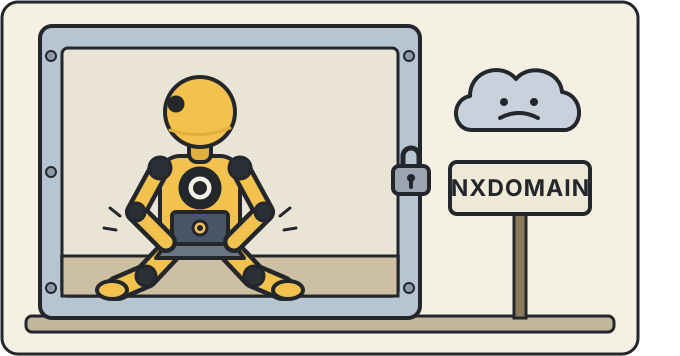

# Sokar for dummies



A plain-language tour of what Sokar does and why. No prior knowledge of containers,
firewalls or git is assumed. Every term is explained the first time it appears.

If you already know what a container and an nftables ruleset are, read
[the README](../README.md) instead — it says the same things in one tenth of the words.

If you are not sure this kind of tool is for you at all, read
[three ways of working](way-of-working.md) first: it explains what such tools put at the centre -
the project, the agent or the person - and where Sokar sits among them, before any of the
machinery below matters.

<br clear="left"/>

## 1. The problem, in one paragraph

An **AI agent** is a program that writes and changes code for you. Normally it stops
and asks before it does anything real: "May I edit this file?", "May I run this
command?". Answering those questions all day is tiring, so most agents have a mode
where they stop asking — commonly called **YOLO mode**. In that mode the agent edits
files, deletes things, installs software and runs commands on its own, with your
computer, your files and your passwords all within reach.

That is convenient and it is also the whole risk. Sokar's job is to make the
convenient thing safe: let the agent work unattended, but give it a room it cannot
get out of.

## 2. The one-sentence answer

**Sokar puts each agent run inside a sealed workshop: it can use the tools and the
copy of your project you put in there, it cannot reach the internet except where you
said so, it never holds your real passwords, and nothing it produces leaves the
workshop until you have looked at it.**

The rest of this document is that sentence, unpacked.

> **Linux only.** The parts that do the sealing are features of the Linux kernel.
> They do not exist on macOS or Windows, so Sokar does not run there.

> **Podman 5 or newer.** Podman is the program that makes the sealed rooms. Older
> versions cannot connect your machine's own loopback into a room, and without that
> the in-tray your agent hands work to would have to sit on your local network, where
> other machines could reach it. Sokar refuses to start rather than run with less than
> it promises. Ubuntu 24.04 ships podman 4 and always will, so on that release you need
> a newer one; Fedora, Debian 13 and Ubuntu 25.10 or later are fine.

## 3. The words you need

| Word | What it means here |
|---|---|
| **Container** | A sealed room for a program. It looks like a whole computer from the inside, but it is one process on your machine with the doors shut. Sokar uses **Podman** to make them. |
| **Rootless** | The room is built by your ordinary user account, not by the machine's administrator. So even in the worst case the program inside has no more power over the machine than you do — and much less. |
| **Image** | The recipe the room is built from: which Linux, which tools, which agent. |
| **Task** | One run of one agent, in one fresh container, on one project. |
| **Egress** | Outbound network traffic — the agent reaching out to the internet. |
| **Firewall (nftables)** | The Linux component that decides which outbound connections are allowed. Each task has its own, and [where it sits and who may change it](firewall.md) is worth reading once. |
| **DNS / resolver (dnsmasq)** | The phone book that turns a name like `github.com` into an address. No name, no connection — and [the refusal happens here first](dns.md), before any traffic is attempted. |
| **Vault** | Sokar's encrypted store on your machine for your API keys and tokens. |
| **Gate** | The in-tray on your machine where the agent's finished work waits for your review. |
| **`project.yml`** | A small text file next to your code that describes what this project's agents are allowed to do. |

## 4. What actually happens when you run a task

You type `sokar task start` in your project directory. Then, in order:

1. **Sokar reads `project.yml`** — the file beside your code that says which Linux to
   start from, how locked down this project is, and what the agent may reach on the
   network. If the file is missing, Sokar offers to write one for you and Enter
   accepts every default.
2. **It builds the image** — the recipe for the room (see section 6).
3. **It writes a firewall ruleset and a phone book for this one task**, derived from
   what `project.yml` declared.
4. **It loads that ruleset into the container before the agent starts.** If loading
   fails, the container does not start at all. This is called **failing closed**: the
   failure mode is "nothing runs", never "runs unprotected".
5. **It puts a copy of your project inside** as `/workspace`, cloned from the gate
   rather than from your working directory, so nothing the agent does can move your
   own files underneath you.
6. **It starts a helper on your side** that holds your real credential, and gives the
   container a fake one (section 5.3).
7. **It prints what it wired up** — the agent, the phantom token, the vault socket,
   the ruleset, how many domains resolve, and the gate address. Those lines are the
   security model in summary; they are worth reading rather than scrolling past.
8. **The agent works.** You either sit in a shell inside the container and watch, or
   you pass `-P "do this and that"` and let it run headlessly with no one watching.
9. **The agent pushes its result to the gate** — your in-tray, on your machine.
10. **The container is destroyed** when you leave. Nothing survives except the work in
    the gate and the audit log. The container is kept when you leave; `--rm` throws it away instead.

## 5. The hardening, point by point

"Hardening" means the things that are there specifically to contain a program that
might misbehave — through a bug, a bad instruction, or a hostile web page it read.

### 5.1 The room has no power switches

Every container has a list of special powers it *could* be granted: change the clock,
open low-numbered network ports, load kernel modules, and so on. Sokar grants **none
of them**, and sets a flag called `no-new-privileges`, which means no program inside
can gain powers it did not start with — not even by the usual Linux trick of running
a program marked "run as administrator".

On top of that the container is **rootless** (built by your user, not the machine's
administrator) and the agent inside runs as an unprivileged account called `agent`.

**In plain terms:** even if something inside were fully hostile, there is nothing to
escalate *to*. The ladder has no rungs.

### 5.2 The network is deny-by-default, and it fails in the right direction

The container's network is not your network. Before the agent runs, Sokar loads a
firewall ruleset that blocks everything, and then opens exactly what `project.yml`
declared. Two details make this stronger than it sounds:

- **It fails closed.** If the ruleset cannot be loaded, the container is not started.
  There is no path where the agent runs and the firewall does not.
- **The block happens one layer earlier than you would expect — at the phone book.**
  The container's DNS resolver is configured to answer "no such host" for *every* name
  except the ones you declared. So an undeclared site gets no address from it, and no
  connection is attempted. Inside the container it simply looks like:

  ```
  Could not resolve host: repo.maven.apache.org
  ```

  This is deliberate. A resolver that answered every name and let the firewall drop the
  traffic afterwards would confirm to the agent that a host exists, and would turn every
  stray lookup into a question for you.

- **An address found some other way opens nothing.** A program can skip the phone book
  and ask one on the internet. It gets an address, but it still cannot connect: the
  firewall lets through only addresses that Sokar's own phone book handed out, or that
  you approved. That the question gets an answer at all is a
  [known gap](dns.md#a-resolver-of-the-agents-own), because the question itself can
  carry data out.

- **Declared names open web ports only** — 80 and 443, the ordinary ports of the web —
  not the whole machine at the other end. So allowing a code-hosting site does not
  hand the agent an `ssh` channel it could push through.

**Declaring nothing reaches nothing.** An empty `egress` section is not a polite
default that quietly widens when a new Sokar release ships more presets. It is deny.

### 5.3 Your real password never goes into the room

This is the piece people find most surprising, so it is worth going slowly.

An agent needs a credential — an API key, or a login token from your subscription — to
talk to the AI provider. The naïve approach is to hand that key to the container. Then
any bug, any prompt-injection attack, any careless log line inside the room can leak
the real key, and a leaked API key can be used by anyone, anywhere, until you notice
and revoke it.

Sokar does it differently:

- Your real credential lives in the **vault**: an encrypted file on your machine,
  unlocked by a passphrase you type once per session. Lose the passphrase and there is
  no recovery — that is the point of a vault.
- The container is given a **phantom token** instead: a random string that looks like a
  key, is valid only for this one task, expires with it, and is worth nothing to
  anybody.
- On the way out, the agent's traffic passes through a small helper of Sokar's,
  reachable only from inside the container. That helper swaps the phantom token for the
  real credential and forwards the request.
- Sokar never puts a secret on a command line, because on Linux the list of running
  commands is readable by every user on the machine. Credentials go in through standard
  input or a private file.

The provider's own website *is* reachable from inside, because agents check that the
provider is up before they start working and stopping that broke every one of them.
That is fine, and here is exactly why: **the thing being kept in is the credential, not
the traffic.** All the container ever holds is the phantom token.

Signing your commits works the same way. The signing key stays on your machine; the
container gets a socket it can ask for a signature through, never the key itself.

### 5.4 Work leaves only through you

The agent does not push its results to GitHub. It pushes them to the **gate**: a copy
of your repository sitting on your own machine, and pushes land in a private holding
area (`refs/sokar/incoming/`) rather than on any branch — so nothing you are looking at
changes under your feet.

That in-tray listens on your machine's loopback only, so nothing else on your network
can reach it — not a colleague's laptop, not another device on the same café wifi. The
agent gets in because Sokar connects your own loopback into the room it started, and
only into that room.

Then, on your side:

```
sokar gate pending              # what is waiting
sokar gate review <task>        # the full diff
sokar gate reject <task>        # bin it
sokar gate approve <task> --upstream git@github.com:you/project.git
```

`approve` is the **only** command that sends anything anywhere, and it makes you name
where. Each project also carries a **security class** that governs this:

| Class | What it means |
|---|---|
| `offline` | Nothing is ever forwarded upstream. `approve` refuses outright, and the project may not declare any network access at all. |
| `guarded` | Work goes to the gate and reaches the outside world only when you approve it. |
| `online` | The agent is given the upstream directly. |

The class belongs to the project file, so **no individual task can talk its way up to a
looser one.**

### 5.5 Everything is written down, whether or not you are watching

Two related mechanisms:

- **The audit log.** Every blocked connection is written to a log file for that task as
  it happens, one line of structured data per event. This does not depend on you being
  at the keyboard, or on any prompt being open.
- **The clearance prompt.** For the narrower case where a name *did* resolve but the
  address is not yet allowed — a bare numeric address, say — the connection is dropped
  and a **desktop notification** appears with **Allow** and **Deny**. You are asked
  **once per destination and never asked again**, in either direction. That last part
  matters: an agent cannot wear you down by retrying until you click the wrong button.

  If the host is something your build genuinely needs, the right fix is to *declare* it
  in `project.yml` rather than clicking Allow. A clearance is one address on one run; a
  declaration is reviewed, shows up in a diff, and applies to everyone who works on the
  project. On a machine with no desktop (a server), choose `--clearance allow`, `deny`
  or `off` instead — the prompt needs a desktop session to appear in.

## 6. The features, point by point

Hardening is what stops bad things. Features are what make the tool usable.

### 6.1 One small file describes the project

`project.yml` sits beside your code and is read by everyone who clones it:

```yaml
project:
  name: "myproject"
  security_class: "guarded"
image:
  base_image: "ubuntu:24.04"
egress:
  sets: [maven]
```

That is the whole configuration surface for the common case. Every task is a fresh
container built from it and thrown away afterwards.

### 6.2 Your build can still fetch its dependencies

Real builds download things — Java libraries, npm packages, Python wheels. Sokar's
answer is to make you *name* what you need:

```yaml
egress:
  sets: [maven, git-hosting]
  domains: ["nexus.corp.example"]     # a private mirror, if you have one
```

A **set** is a named, pre-reviewed group of hosts — `maven`, `nodejs` and so on; run
`sokar shield sets` to list them. Writing a set once means "reaching npm" is the same
thing in every project instead of each one inventing its own list. `domains` is the
escape hatch for a host no set covers. Anything you did not name does not resolve.

### 6.3 The image is built in three layers

1. **Base** — the Linux distribution your project named, plus the unprivileged `agent`
   user and a `/workspace`.
2. **Agent** — the agent's own command-line tool. This layer is *pinned*: it is fetched
   from a fixed address and checked against a **SHA-256** (a fingerprint of the exact
   bytes) before it is allowed to run, or it comes prepackaged and is verified once
   where that package was built. There is no `curl | bash` — no "download a script off
   the internet and run it immediately" — inside a tool whose job is containment.
3. **Project** — your own lines: extra tools, pre-fetched dependencies, whatever you
   want baked in.

Your lines run as administrator inside the *image build* and after the agent layer, so
they can install packages and rely on the agent already being there. `sokar task start
--dry-run` shows you the generated recipe without building it, and the recipe is left on
disk to be read.

### 6.4 Interactive or unattended

By default you get a shell inside the container and can watch. `-P "your prompt"` runs
the agent headlessly instead and formats what it says. Because containment does not
depend on you being present, "unattended" is a real option rather than a leap of faith.

### 6.5 Agents are packages, not patches

Each supported agent — Claude Code, Pi, and more coming — is its own installable
package, discovered by Sokar scanning a directory at startup. Nothing inside Sokar
mentions any agent by name, and an automated test fails the build if anything ever
starts to. Practically: **adding an agent means adding a package, not changing Sokar**,
and you can add a private one that will never be published.

### 6.6 It tells you when the machine is not ready

`sokar doctor` checks the pieces Sokar depends on and reports on them. Two checks are
worth knowing by name. **`podman`** must be version 5 or newer, for the reason in the
box near the top — doctor says so plainly if it is not. And **`dnsmasq nftset`**:
without that capability, declared domains resolve but nothing connects, and there is
no error explaining why. If doctor reports anything but `yes` there, fix it before your
first task.

## 7. What Sokar does *not* do

An honest tool tells you where its guarantees stop.

- **The gate is a review workflow, not a network control.** It holds because the
  container has no credential for your code-hosting account — not because that host is
  unreachable. An agent that finds a usable token lying around in your work tree could
  push with it, whatever the security class says. Do not leave credentials in the
  repository.
- **Declaring a code-hosting set makes that host reachable.** That is legitimate — agents
  clone dependencies — but it removes one of the two reasons the gate holds. Sokar says
  so at task start rather than refusing.
- **The image build is not governed by the firewall.** Firewalling applies to the
  running task. The build step that assembles the image can fetch from anywhere, by
  design, since that is when you install your tools.
- **The Fedora package set cannot be complete.** Fedora's package manager asks for a
  list of mirrors and then downloads from whichever machines that list names — arbitrary
  hosts that differ by region and by day. Each one raises a prompt. Debian and Ubuntu
  use stable names and are covered.
- **Sokar is Linux-only**, for the reasons in section 2.

## 8. If you remember five things

1. The agent works inside a container with **no special powers and nothing to escalate
   to**.
2. The network is **deny-by-default and fails closed**; an undeclared host does not even
   have an address.
3. Your **real credential never enters the container** — only a task-scoped phantom
   token that is worthless outside this one run.
4. Work leaves only through the **gate**, and only when you approve it.
5. Everything blocked is **recorded**, whether or not anyone is watching.

## Where to go next

- [README](../README.md) — the short version, and the list of supported agents and providers
- [Getting started on Debian and Ubuntu](getting-started-debian.md) · [on Fedora and RHEL](getting-started-fedora.md) — step by step, with what goes wrong when a step is skipped
- [FAQ](faq.md) — network questions in particular
- [The firewall](firewall.md) · [DNS and the resolver](dns.md) — how the network half actually works
- [Adding your tools to a container](your-tooling.md)
- [Why build this](why.md)
